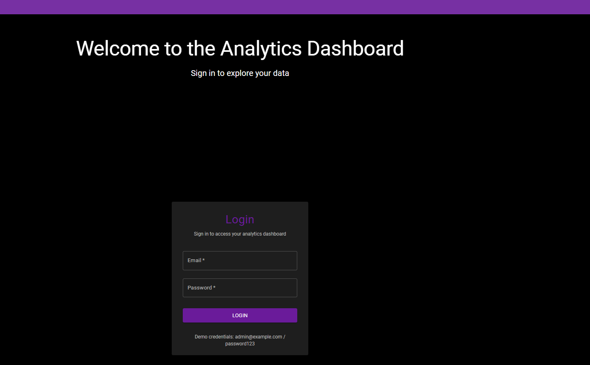
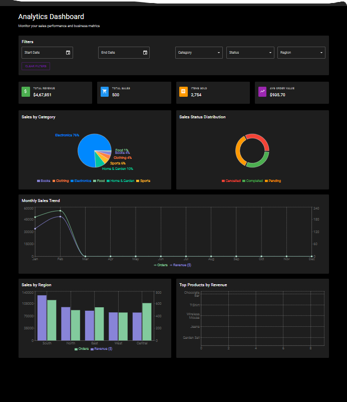

# Data Analytics Dashboard

A full-stack web application for visualizing sales and business analytics with interactive charts and real-time data filtering.

## 🚀 Features

### Core Features
- **5+ Interactive Charts**: Pie, Line, Bar, Horizontal Bar, and Doughnut charts
- **Real-time Filtering**: Filter by date range, category, status, and region
- **Responsive Design**: Works seamlessly on desktop, tablet, and mobile devices
- **REST APIs**: Complete backend API with Express.js and MongoDB
- **JWT Authentication**: Secure login/logout functionality
- **Loading States**: Proper loading indicators and error handling
- **Modern UI**: Built with Material-UI components

### Dashboard Components
1. **Summary Cards**: Total Revenue, Total Sales, Items Sold, Average Order Value
2. **Sales by Category**: Pie chart showing revenue distribution
3. **Monthly Sales Trend**: Line chart with revenue and order trends
4. **Sales by Region**: Bar chart comparing regional performance
5. **Top Products**: Horizontal bar chart of best-selling products
6. **Sales Status Distribution**: Doughnut chart showing order statuses

## 🛠 Tech Stack

### Frontend
- **React 18** with TypeScript
- **Material-UI (MUI)** for UI components
- **Recharts** for data visualization
- **Axios** for API communication
- **React Router** for navigation
- **Day.js** for date handling

### Backend
- **Node.js** with Express.js
- **MongoDB** with Mongoose ODM
- **JWT** for authentication
- **bcryptjs** for password hashing
- **CORS** for cross-origin requests

## 📁 Project Structure

```
assignment/
├── backend/
│   ├── models/
│   │   ├── User.js          # User schema
│   │   ├── Sale.js          # Sales transaction schema
│   │   └── Product.js       # Product inventory schema
│   ├── routes/
│   │   ├── auth.js          # Authentication routes
│   │   └── analytics.js     # Analytics data routes
│   ├── server.js            # Main server file
│   ├── seed.js              # Database seeding script
│   ├── package.json
│   └── .env                 # Environment variables
├── frontend/
│   ├── src/
│   │   ├── components/
│   │   │   ├── Dashboard/
│   │   │   │   ├── Dashboard.tsx
│   │   │   │   ├── SummaryCards.tsx
│   │   │   │   ├── SalesByCategoryChart.tsx
│   │   │   │   ├── MonthlySalesChart.tsx
│   │   │   │   ├── SalesByRegionChart.tsx
│   │   │   │   ├── TopProductsChart.tsx
│   │   │   │   ├── SalesStatusChart.tsx
│   │   │   │   └── FilterPanel.tsx
│   │   │   └── Auth/
│   │   │       └── Login.tsx
│   │   ├── services/
│   │   │   └── api.ts       # API service layer
│   │   ├── types/
│   │   │   └── index.ts     # TypeScript type definitions
│   │   └── App.tsx          # Main App component
│   ├── package.json
│   └── .env                 # Environment variables
└── README.md
```

## 🚀 Getting Started

### Prerequisites
- Node.js (v16 or higher)
- MongoDB (running locally or MongoDB Atlas)
- npm or yarn

### Installation

1. **Clone the repository**
   ```bash
   git clone <repository-url>
   cd assignment
   ```

2. **Backend Setup**
   ```bash
   cd backend
   npm install
   ```

3. **Configure Backend Environment**
   - Create a `.env` file in the `backend` directory:
   ```
   PORT=5000
   MONGODB_URI=mongodb://localhost:27017/analytics_dashboard
   JWT_SECRET=your_jwt_secret_key_here
   ```

4. **Seed the Database**
   ```bash
   npm run seed
   ```

5. **Start Backend Server**
   ```bash
   npm run dev
   ```
6. **Frontend Setup**
   ```bash
   cd ../frontend
   npm install
   ```

7. **Configure Frontend Environment**
   - Create a `.env` file in the `frontend` directory:
   ```
   REACT_APP_API_URL=http://localhost:5000/api
   ```

8. **Start Frontend Development Server**
   ```bash
   npm start
   ```

9. **Access the Application**
   - Frontend: http://localhost:3000
   - Backend API: http://localhost:5000

## 📊 API Endpoints

### Authentication
- `POST /api/auth/register` - Register new user
- `POST /api/auth/login` - User login

### Analytics Data
- `GET /api/analytics/summary` - Dashboard summary statistics
- `GET /api/analytics/sales` - Sales data with filtering
- `GET /api/analytics/sales-by-category` - Sales grouped by category
- `GET /api/analytics/monthly-sales` - Monthly sales trends
- `GET /api/analytics/sales-by-region` - Sales grouped by region
- `GET /api/analytics/top-products` - Top performing products
- `GET /api/analytics/sales-status` - Sales status distribution
- `GET /api/analytics/products-stats` - Product inventory statistics

### Query Parameters
All analytics endpoints support the following optional parameters:
- `startDate` - Filter by start date (ISO format)
- `endDate` - Filter by end date (ISO format)
- `category` - Filter by product category
- `status` - Filter by order status
- `region` - Filter by sales region

## 🗄 Database Schema

### User Collection
```javascript
{
  username: String,
  email: String,
  password: String (hashed),
  role: String ('admin' | 'user'),
  timestamps: true
}
```

### Sale Collection
```javascript
{
  product: String,
  category: String,
  amount: Number,
  quantity: Number,
  date: Date,
  status: String ('completed' | 'pending' | 'cancelled'),
  region: String,
  timestamps: true
}
```

### Product Collection
```javascript
{
  name: String,
  category: String,
  price: Number,
  stock: Number,
  rating: Number (0-5),
  brand: String,
  timestamps: true
}
```

## 🎨 Dashboard Screenshots

### Home Screen

*Landing page or project home view*

### Dashboard Overview

*Complete analytics dashboard with summary cards and multiple chart types*

## 🔐 Authentication

The application uses JWT-based authentication:

1. **Registration**: Users can create an account with username, email, and password
2. **Login**: Existing users can authenticate with their credentials
3. **Token Management**: JWT tokens are stored in localStorage and sent with API requests
4. **Logout**: Users can securely log out and clear their session

**Demo Credentials**:
- Email: `admin@example.com`
- Password: `password123`

## 📱 Responsive Design

The dashboard is fully responsive and works on:
- **Desktop**: Full-featured experience with all charts visible
- **Tablet**: Optimized layout with responsive grid system
- **Mobile**: Stacked layout with touch-friendly interactions

## 🎯 Key Features Implemented

✅ **REST APIs** - Complete Express.js backend with MongoDB  
✅ **Database Integration** - MongoDB with sample data seeding  
✅ **5+ Chart Types** - Pie, Line, Bar, Horizontal Bar, Doughnut charts  
✅ **Filtering System** - Date range, category, status, and region filters  
✅ **Folder Structure** - Clean separation of frontend and backend  
✅ **Loading States** - Proper loading indicators throughout the app  
✅ **Error Handling** - Comprehensive error handling with user feedback  
✅ **JWT Authentication** - Secure login/logout functionality  
✅ **Responsive UI** - Mobile-first responsive design  
✅ **Clean Code** - Well-structured, maintainable codebase  

## 🚀 Deployment

### Backend Deployment (Render/Railway)
1. Push backend code to repository
2. Connect to deployment platform
3. Set environment variables:
   - `MONGODB_URI` - Your MongoDB connection string
   - `JWT_SECRET` - Your JWT secret key
   - `PORT` - Port number (usually provided by platform)

### Frontend Deployment (Vercel/Netlify)
1. Push frontend code to repository
2. Connect to deployment platform
3. Set environment variable:
   - `REACT_APP_API_URL` - Your deployed backend API URL

## 🤝 Contributing

1. Fork the repository
2. Create a feature branch (`git checkout -b feature/AmazingFeature`)
3. Commit your changes (`git commit -m 'Add some AmazingFeature'`)
4. Push to the branch (`git push origin feature/AmazingFeature`)
5. Open a Pull Request

## 📝 License

This project is licensed under the MIT License - see the LICENSE file for details.

## 🙏 Acknowledgments

- React team for the amazing framework
- Material-UI for the excellent component library
- Recharts for the powerful charting library
- MongoDB for the flexible database solution
=======
# reactapp
>>>>>>> 8ab26354a285d204ceb179c1ecb9954589fc8caf
